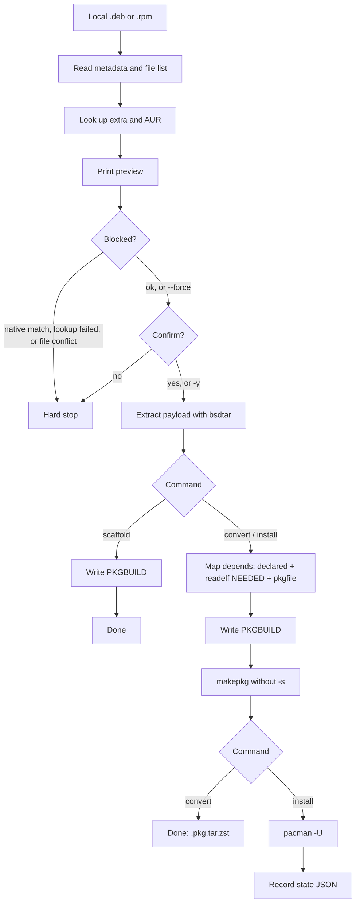
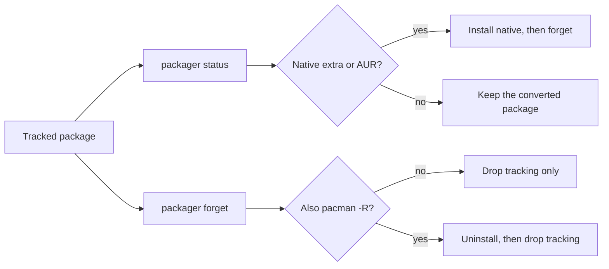

# packager

Arch Linux utility that turns a **local** `.deb` or `.rpm` into a real pacman package.

Temporary bridge until extra or an AUR maintainer ships a native package. Not a package manager, not an AUR helper (`yay`/`paru`), and not a bidirectional converter.

Default path: preview → PKGBUILD → `makepkg` → `pacman -U`. Use `convert` to stop before install, or `scaffold` to stop after the PKGBUILD.

## Runtime tools

These must be on `PATH`:

| Tool | Role |
|---|---|
| `bsdtar` | Unpack `.deb` / `.rpm` payload |
| `readelf` (binutils) | ELF `NEEDED`, interpreter, class |
| `pkgfile` | Map shared libraries to Arch packages |
| `makepkg` / `fakeroot` | Build the pacman package (no `-s`) |
| `pacman` | `-U` / `-Q` / `-R` / ownership / extra sync DB |

AUR lookups use the AUR RPC over the network; extra/multilib use the local pacman sync DB.

## Build

```bash
make build      # cargo build --release
make release    # locked release binary (same profile as GitHub tag artifacts)
```

Binary: `target/release/packager` (or `target/debug/packager` after `cargo build`).

Release profile (`Cargo.toml`): fat LTO, one codegen unit, stripped, `panic = abort`. Push a `v*` tag to publish a GitHub Release.

## Usage

```text
packager foo.deb              # default = install
packager foo.rpm
packager install foo.deb

packager convert foo.deb      # preview + makepkg, do not install
packager scaffold foo.deb     # write PKGBUILD only

packager status               # tracked converts; native extra/AUR now?
packager forget <pkg>         # stop tracking; ask whether to pacman -R
```

### Flags

| Flag | Effect |
|---|---|
| `--force` | Continue if extra/AUR already has a match, or if packaged files would overwrite another package’s files |
| `--allow-scripts` | Copy vendor scripts into a pacman `.install` (pacman runs them on `-U`; it never runs them during convert) |
| `--yes` / `-y` | Skip the confirm prompt after preview; also allows `pacman --noconfirm` on the action you asked for |
| `--workdir DIR` | Where to put the PKGBUILD and built package (default: `~/.cache/packager/<pkg>-<ver>/`) |

### Script policy

Vendor `postinst` / `%post` scripts are never executed during convert. By default they are left out of the package. Only with `--allow-scripts` are they packaged as `.install` so pacman can run them on `-U`. It does not rewrite `update-alternatives`, `update-rc.d`, `debconf`, or RPM scriptlet helpers into Arch.

### Policies

- Native extra/AUR match → hard stop unless `--force`
- Offline / failed lookup → hard stop unless `--force` (it never claims “no native package” when lookup failed)
- Unmapped depends are omitted from the PKGBUILD (not invented)
- `makepkg -s` is not used
- Lib path oddities (`/usr/lib/x86_64-linux-gnu`, `/usr/lib64`, …) are detected and warned; paths are **not** rewritten
- State: `~/.local/share/packager/installed/<pkgname>.json` (original user when invoked via sudo)

## Tests

```bash
make test                    # unit + library tests; no root, no pacman -U
sudo -E make test-system     # opt-in @system tests (feature "system"); needs root and SUDO_USER
```

`make test` sets `RUST_TEST_THREADS=1` and runs `cargo test --lib`. It does **not** compile or run the system integration tests.

`make test-system` must be run as `sudo -E make test-system`. Root is required (`pacman -U` / `-R`), and `SUDO_USER` must be set so `makepkg` can drop privileges and state is written under the original user. A plain `sudo make test-system` (without `-E`) can drop `SUDO_USER`. Those tests panic if not root.

Do not commit vendor `.deb` / `.rpm` blobs.

## How it works



After a successful install, `status` checks whether extra or the AUR now has a native package, and `forget` drops tracking (optionally `pacman -R`):


